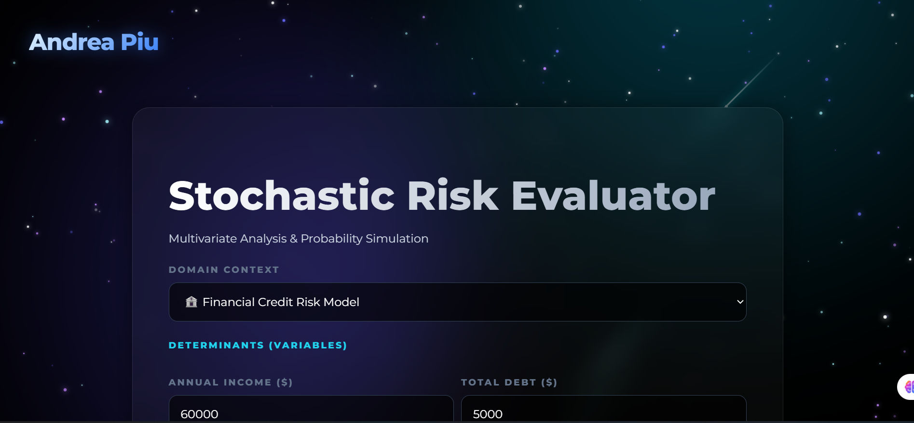
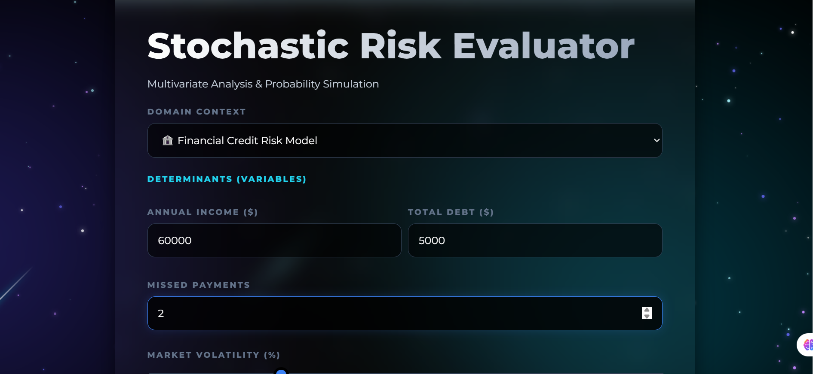
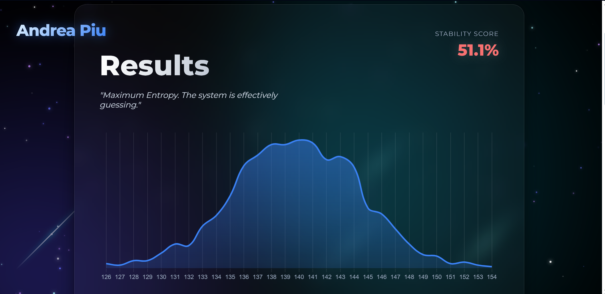

````markdown
<div align="center">
  
</div>

<br />

<div align="center">
  <h1 align="center">Decision Uncertainty Simulator 🌌</h1>

  <p align="center">
    <strong>A Quantum Glassmorphism visualization tool that demonstrates how noise collapses binary decisions into probabilities.</strong>
  </p>

  <p align="center">
    
    
    
    
  </p>

  <p align="center">
    <a href="#-key-features"><strong>Explore Features »</strong></a>
    ·
    <a href="#-installation--setup"><strong>Install Locally »</strong></a>
    ·
    <a href="#-design-philosophy"><strong>View Design »</strong></a>
  </p>
</div>

<br />

## 📸 Interface Gallery

Here is a look at the two main phases of the simulation:

| **1. The Configuration Phase** | **2. The Revelation Phase** |
|:---:|:---:|
|  |  |
| *Users define thresholds in a Hyper-Drive environment.* | *Monte Carlo simulations visualize the probability curve.* |

---

## 🚀 Overview

Real-world decisions are rarely binary. While a rule might state *"Credit Score > 700 = Approved,"* reality is full of noise—human error, data fluctuations, and edge cases.

The **Decision Uncertainty Simulator** allows users to:
1.  **Define a Rule:** Set a threshold for scenarios like Medical Diagnosis or Loan Approval.
2.  **Inject Entropy:** Use a slider to add "Uncertainty (Noise)" to the system.
3.  **Visualize the Collapse:** Watch how a deterministic "Yes/No" decision transforms into a probability distribution (Bell Curve) using 10,000 Monte Carlo iterations.

---

## ✨ Key Features

### 🎨 Hyper-Drive UI/UX
* **Galactic Particle Engine:** A custom-built background featuring 200+ fast-moving stars, 15 looping meteors, and churning nebula clouds.
* **Quantum Glassmorphism:** Deep frosted-glass cards (`backdrop-filter: blur(16px)`) that allow the animated galaxy to shine through.
* **Cinematic Depth:** Three layers of parallax movement (Orbs, Stars, Content) create a 3D immersive experience.
* **Anticipation UX:** Simulated calculation delays with pulsing "Analyzing..." animations to build user engagement.

### 🧠 Core Functionality
* **Scenario Builder:** Includes presets (Medical, Financial) and a Custom Rule builder.
* **Monte Carlo Simulation:** Runs backend simulations to generate probability density functions (PDF).
* **Data Visualization:** Interactive Line Charts using `Chart.js` with gradient fills.
* **Event Horizon Logs:** Detailed tables highlighting "Near Misses" and "Flips" (where noise changed the outcome).

---

## 🛠️ Tech Stack

### Frontend
* **Framework:** React.js
* **Styling:** CSS3 Variables, Glassmorphism, CSS Keyframe Animations.
* **Charts:** React-Chartjs-2 / Chart.js.
* **Fonts:** Montserrat (Google Fonts).

### Backend
* **Runtime:** Node.js
* **Server:** Express.js
* **Logic:** Gaussian (Normal) Distribution algorithms for probability simulation.

---

## ⚙️ Installation & Setup

Follow these steps to run the simulator on your local machine.

### Prerequisites
* Node.js (v14 or higher)
* npm

### 1. Clone the Repository
```bash
git clone [https://github.com/your-username/decision-simulator.git](https://github.com/your-username/decision-simulator.git)
cd decision-simulator
````

### 2\. Setup the Backend (Server)

The backend handles the simulation logic.

```bash
cd server
npm install
npm start
# Server runs on http://localhost:5000
```

### 3\. Setup the Frontend (Client)

Open a new terminal tab.

```bash
cd client
npm install
npm start
# Client runs on http://localhost:3000
```

-----

## 📂 Project Structure

```bash
decision-simulator/
├── client/                 # React Frontend
│   ├── src/
│   │   ├── App.js          # Main Router & Layering Logic
│   │   ├── Background.js   # The "Hyper-Drive" Particle Engine
│   │   ├── LandingPage.jsx # Configuration UI
│   │   ├── ResultPage.jsx  # Visualization Dashboard
│   │   └── App.css         # Global Styles & Animations
│   └── public/
│       └── index.html      # Font preloading
├── server/                 # Node.js Backend
│   ├── index.js            # Simulation API Endpoints
│   └── package.json
└── screenshots/            # Project Images
    ├── banner.png          # Wide header shot
    ├── landing.png         # Input screen
    └── result.png          # Chart screen
```

-----

## 🎨 Design Philosophy

This project rejects the sterile "Corporate Dashboard" look in favor of a **Cinematic Sci-Fi** aesthetic.

  * **The Colors:** A strict palette of Deep Space Black (`#000000`), Cyan (`#22d3ee`), and Indigo (`#6366f1`) creates high contrast.
  * **The Typography:** **Montserrat** was chosen for its geometric, futuristic clarity.
  * **The Logo:** "Ändrea Piu" uses a linear-gradient text clip and GPU-forced rendering (`translateZ`) to ensure it remains the crisp focal point above the moving starfield.

-----

## 👤 Author

**Andrea Piu**

  * *Full Stack Developer & UI Designer*

-----

*This project is for educational and portfolio purposes.*

```
```